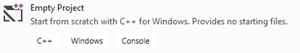

# Workshop #1: Modules   
 
In process of doing your first workshop, in part 1 you are to sub-divide a program into modules, compile each module separately and construct an executable from the results of each compilation. In Part 2 (**DIY**) you are to write a modular program based on your knowledge of ipc144 subject. 

## Learning Outcomes

Upon successful completion of this workshop, you will have demonstrated the abilities to:
- organize source code into modules, using header and implementation files;
- compile and link modular programs;
- distinguish the contents of a header and an implementation file;
- describe to your instructor what you have learned in completing this workshop.


## Submission Policy

This workshop is divided into two coding parts and one non-coding part:

- Part 1: A step-by-step guided workshop, worth 50% of the workshop's total mark that is due on **Thursday at 23:59:59** of the week of your scheduled lab.
> Please note that the part 1 section is **not to be started in your first session of the week**. You should start it on your own before the day of your OOP244 class and join the first session of the week to ask for help and correct your mistakes (if there are any).
- Part 2 (**DIY**): A Do It Yourself type of workshop that is much more open-ended and is worth 50% of the workshop's total mark. This part is due on **Sunday at 23:59:59** of the week of your scheduled lab.  
- *reflection*: non-coding part, to be submitted together with *DIY* part. The reflection doesn't have marks associated with it but can incur a **penalty of max 40% of the whole workshop's mark** if your professor deems it insufficient (you make your marks from the code, but you can lose some on the reflection).
- Submissions of part 2 that do not contain the *reflection* (that is the **non-coding part**) are not considered valid submissions and are ignored.


If at the deadline the workshop is not complete, there is an extension of **one day** when you can submit the missing parts.  **The code parts that are submitted late receive 0%.**  After this extra day, the submission closes; if the workshop is incomplete when the submission closes (missing at least one of the coding or non-coding parts), **the mark for the entire workshop is 0%**.

Every file that you submit must contain (as a comment) at the top:<br />
**your name**, **your Seneca email**, **Seneca Student ID** and the **date** when you completed the work.

If the file contains only your work or work provided to you by your professor, add the following message as a comment at the top of the file:

> I have done all the coding by myself and only copied the code that my professor provided to complete my workshops and assignments.


If the file contains work that is not yours (you found it online or somebody provided it to you), **write exactly which part of the assignment is given to you as help, who gave it to you, or which source you received it from.**  By doing this you will only lose the mark for the parts you got help for, and the person helping you will be clear of any wrongdoing.

## Compiling and Testing Your Program

All your code should be compiled using this command on `matrix`:

```bash
g++ -Wall -std=c++11 -g -o ws file1.cpp file2.cpp ...
```

- `-Wall`: the compiler will report all warnings
- `-std=c++11`: the code will be compiled using the C++11 standard
- `-g`: the executable file will contain debugging symbols, allowing *valgrind* to create better reports
- `-o ws`: the compiled application will be named `ws`

After compiling and testing your code, run your program as following to check for possible memory leaks (assuming your executable name is `ws`):

```bash
valgrind ws
```

To check the output, use a program that can compare text files.  Search online for such a program for your platform, or use *diff* available on `matrix`.

# Part 1  (Lab - 50%)
## Original source code "The WrodStat Program" (w1p1.cpp)
**WordStat** is a program that reads a text file and analyzes and reports the number of words and their occurrences in the text file.

Here is a sample execution of the program 

[Part 1 Execution example](lab/sampleExecution.md)


## Step 1: *Test the Program*

### On Visual Studio
- Open Visual studio 2019 and create an Empty C++ Windows Console Project:<br />

- In VS, (if not open already) open Solution Explorer (click on View/Solution Explorer) and then add w1p1.cpp file to your project:<br />
-Right-click on **“Source Files”**<br />
-Select **“Add/Existing Item”**<br />
-Select **w1p1.cpp** from the file browser<br />
-Click on **“Ok”**
- Now you can run the program by selecting **“Debug/Start Without Debugging”** or pressing the **“Ctr-F5”** button. 
### On Linux, in your Matrix account
- Connect to Seneca with [Global Protect VPN](https://inside.senecacollege.ca/its/services/vpn/studentvpn.html)
- Upload **w1p1.cpp** and **shoppinglist.csv** to your matrix account (Ideally to a designated directory for your workshop solutions). Then, enter the following command to compile the source file and create an executable called ws:
```bash
g++ w1p1.cpp -Wall -std=c++11 -o ws<ENTER>

-Wall: display all warnings
-std=c++11: compile using C++11 standards
-o ws:  name the executable ws
```
- Type the following to run and test the execution:
```bash
ws<ENTER>
```

## Step 2: Create the Modules
### On Windows, using Visual Studio (VS)
In the solution explorer, add two new modules to your project:
- **cStrTools**; A module for string and character related functions 
- **Word**; A module to hold the functions and constant values related to word statistics processing.
- **WordStat**; main module that is caller of the initial functions of the WordStat program.

The **WordStat** module has an implementation (.cpp) file but no header file. The **cStrTools** and **Word** modules have both implementation (.cpp) and header (.h) files:

#### Header files
Add **cStrTools.h** and  **Word.h** to the “Header Files” directory (right click on “Header Files” and select “Add/New Item” and add a header file)<br />

Make sure you add the compilation safeguards to the header files.

Also remember that all the C++ code in the modules are in namespace called “sdds”, except the main module the uses the sdds namespace.

##### Compilation Safeguards
**compilation safeguards** refer to a technique to guard against multiple inclusion of header files. It does so by applying macros that check against a defined name:
```C++
#ifndef NAMESPACE_HEADERFILENAME_H // replace with relevant names
#define NAMESPACE_HEADERFILENAME_H
namespace sdds{

// Your header file content goes here

}
#endif
```
If the name isn’t yet defined, the **#ifndef** will allow the code to proceed onward to then define that same name. Following that the header is then included. If the name is already defined, meaning the file has been included prior (otherwise the name wouldn’t have been defined), the check fails, the code proceeds no further and the header is not included again.<br />
Compilation safeguards prevent multiple inclusions of a header in a module. They do not protect against including the header again in a different module (remember that each module is compiled independently from other modules).<br />
Additionally, here is an instructional video showing how the compiler works and why you need these safeguards in all of your header files. Do note that this video describes the intent and concept behind safeguards, the naming scheme isn’t the standard for our class. Follow the standard for safeguards as described in your class.<br />
[Compilation Safegards](https://www.youtube.com/watch?v=EGak2R7QdHo): https://www.youtube.com/watch?v=EGak2R7QdHo

#### CPP Source Files
Add **cStrTools.cpp**, **Word.cpp** and **WordStat.cpp** to the “Source Files” directory (right click on “Source Files” and select “Add/New Item” and add a C++ file)<br />

## Step 3: The main Module

### WordStat main Module 
(The module holding the **main** function)

**WordStat.cpp** file should contain the following code:
```C++
```C++
#include <iostream>
#include "Word.h"
using namespace sdds;
using namespace std;
int main() {
   char filename[256];
   programTitle();
   cout << "Enter filename: ";
   cin >> filename;
   wordStats(filename);
   return 0;
}

```


## Step 4: organize the code in modules
-----------------------------------------------

Separate the rest of the functions in **w1p1.cpp** and copy them into the remaining modules as described below. Copy the body of the functions into the cpp files and the prototypes into the header files. 

#### Guideline for creating modules
##### #includes
Avoid unnecessary random includes and only include a header file in a cpp file in which the header file functions are called or the header file definitions are used. <br />
Do not include a header file inside another header file unless it is absolutely necessary.

##### Structure definitions
Structure definitions must be kept in the header file to be visible to all the modules using it.

##### Constant value declarations 
The Constant value declarations are to be added to the file they are used in; if they are used in a header file, they must be added to the header file otherwise they must be added to the CPP file they are used in.

##### Namespace
All your code (in header files and CPP files) must be surrounded by the **sdds** namespace except in the module holding the **main** function.<br />

The **main** module should use the **sdds** namespace (```using namespace sdds;```).<br />

> important: Never use the **using** statement in a header file.


### cStrTools module
This module Contains the ***cString*** and character related functions.
#### Functions
```Text
toLower
strCmp
strnCmp
strStr
strCpy
strLen
isAlpha
isSpace
trim
toLowerCaseAndCopy
```

### Word module

#### The Word Structure

```C++
   struct Word {
      char letters[MAX_WORD_LEN];
      int count;
   };
```

#### Functions

```Text
searchWords
addWord
readWord
title
endList
totalWordsStat
print
findMaxLen
listWords
swap
sort
totalCount
wordStats
programTitle
```

#### Constant Value Declarations
```text
MAX_WORD_LEN   // used in header file
MAX_NO_OF_WORDS  // used in cpp file
SORT_BY_OCCURANCE   // ...
SORT_ALPHABETICALLY  // ...
```

-------------------------------

## Step 5: Testing
### Testing the Shopping List Application
#### Windows
To test that you have done this correctly, you can compile each module separately, by right-clicking on ***cStrTools.cpp**, **Word.cpp** and  **WordStat.cpp**separately and select compile from the menu. If the compilation is successful, most likely you have done it correctly.

The equivalent of this on matrix is to add -c to the compile command:
```Bash
g++ cstrTools.cpp –Wall -std=c++11 –c<ENTER>
g++ Word.cpp –Wall -std=c++11 –c<ENTER>
g++ WordStat.cpp –Wall -std=c++11 –c<ENTER>
```

Now remove **w1p1.cpp** from the project. You can do this by right-clicking on the filename in solution explorer and selecting Remove in the menu (make sure you do not delete this file but only remove it).
Compile and run the project (as you did before in Step 1) and make sure everything works.
#### Matrix (Linux)
On Linux, in your matrix account, upload all the module files and the text file  **FoxInSocks.txt** to your matrix account.

and compile the source code using the following command.

```Bash
g++ cStrTools.cpp Word.cpp WordStat.cpp -Wall -std=c++11 -o ws<ENTER>
```
Run the program like before with the **FoxInSocks.txt** file and make sure that everything still works properly. 

## LAB Submission (part 1)

Files to submit:  

```Text
cStrTools.h
cStrTools.cpp
Word.h
Word.cpp
WordStat.cpp
```

Upload your source code and `FoxInSocks.txt` to your `matrix` account. Compile and run your code using the `g++` compiler as shown above and make sure that everything works properly.

Then, run the following command from your account
- replace `profname.proflastname` with your professor’s Seneca userid
- replace **??** with your subject code (2**00** or 2**44**)
```
~profname.proflastname/submit 2??/w1/p1
```
and follow the instructions.

To see different submission options:
```
~profname.proflastname/submit<ENTER>
```
To Check the due date:
```
~profname.proflastname/submit -due<ENTER>
```


>  **⚠️Important:**  Please note that a successful submission does not guarantee full credit for this workshop. If the professor is not satisfied with your implementation, your professor may ask you to resubmit. Re-submissions will attract a penalty.


# DIY (50%) The Phone Directory

Write a program for a phone directory by reusing the `cStrTools` module of part one and adding a **`Phone`** module and a **`directory`** main module.

This program should be set up using a title for the phone directory and a file name for a data file. (see the directory module)

# the data file
The data file holds records of a phone number in a tab separated format as follows:

```[Name]\t[areaCode]\t[prefix]\t[number]\n```

For example the following information:

```Fred Soley (416)555-0123```

is kept in the file as follows:  

```Fred Soley\t416\t491\t0123\n```

> Hint: to read the above record use the follwing **fscanf** format<br />```fscanf(fptr, "%[^\t]\t%s\t%s\t%s\n",name,area,prefix,number)```

[view The data file](DIY/phones.txt)

> the maximum length for a name is 50 characters.

## Execution

- When running, after showing the title, the program should prompt for a partial name entry. 
- After receiving the partial name the program should search through the names in the file and if a name is found containing the partial entry, the matching phone recored is displayed.
- Nothing is displayed if no match is found.
- If the user enters '**!**' the program exits.
- If the data file could not be opened the program exits displaying an error message
- A thank you message is displayed at the end of the program.

> For output formatting and messages, see the execution samples 


## Phone module

Only one mandatory function is required for the Phone module:  
```C++
// runs the phone directory appication
void phoneDir(const char* programTitle, const char* fileName);
```

You are free to create any function you find necessary to accomplish this task.

## Tester Program

```C++
/* ------------------------------------------------------
Workshop 1 part 2
Module: directory
Filename: directory.cpp
Version 1
Author	Fardad Soleimanloo
Revision History
-----------------------------------------------------------
Date       Reason
-----------------------------------------------------------*/
#include "Phone.h"
using namespace sdds;
int main() {
   phoneDir("Star Wars", "phones.txt");
   return 0;
}
```

## DIY Execution example (existing data file)
```Text
Star Wars phone direcotry search
-------------------------------------------------------
Enter a partial name to search (no spaces) or enter '!' to exit
> lukE
Luke Skywalker: (301) 555-0630
Enter a partial name to search (no spaces) or enter '!' to exit
> sky
Luke Skywalker: (301) 555-0630
Enter a partial name to search (no spaces) or enter '!' to exit
> fett
Jango Fett: (905) 555-6016
Boba Fett: (905) 555-9382
Enter a partial name to search (no spaces) or enter '!' to exit
> feT
Jango Fett: (905) 555-6016
Boba Fett: (905) 555-9382
Enter a partial name to search (no spaces) or enter '!' to exit
> Jack
Enter a partial name to search (no spaces) or enter '!' to exit
> !
Thank you for using Star Wars directory.

```

## DIY unsuccessful execution

```C++
#include "Phone.h"
using namespace sdds;
int main() {
   phoneDir("Star Wars", "badfile.txt");
   return 0;
}
```


## DIY unsuccessful Execution example (data file not found)
```Text
Star Wars phone direcotry search
-------------------------------------------------------
badfile.txt file not found!
Thank you for using Star Wars directory.

D:\Users\phard\Documents\Seneca\oop244\DEV\Workshops\WS01\DIY\Debug\DIY.exe (process 8424) exited with code 0.
Press any key to close this window . . .
```

Files to submit:  
```Text
cStrTools.h
cStrTools.cpp
Phone.h
Phone.cpp
direcotry.cpp
```

## Reflection

Study your final solutions for each deliverable of the workshop, reread the related parts of the course notes, and make sure that you have understood the concepts covered by this workshop.  **This should take no less than 30 minutes of your time and the result is suggested to be at least 150 words in length.**

Create a file named `reflect.txt` that contains your detailed description of the topics that you have learned in completing this workshop and mention any issues that caused you difficulty.

You may be asked to talk about your reflection (as a presentation) in class.

## DIY Submission (part 2)

To test and demonstrate the execution of your program use the same data as shown in the [DIY Execution example](#diy-execution-example-existing-data-file).

Upload your source code and `phones.txt` to your `matrix` account. Compile and run your code using the `g++` compiler as shown above and make sure that everything works properly.

Then, run the following command from your account
- replace `profname.proflastname` with your professor’s Seneca userid
- replace **??** with your subject code (2**00** or 2**44**)
```
~profname.proflastname/submit 2??/w1/p2
```
and follow the instructions.

To see different submission options:
```
~profname.proflastname/submit<ENTER>
```
To Check the due date:
```
~profname.proflastname/submit -due<ENTER>
```


>  **⚠️Important:**  Please note that a successful submission does not guarantee full credit for this workshop. If the professor is not satisfied with your implementation, your professor may ask you to resubmit. Re-submissions will attract a penalty.

